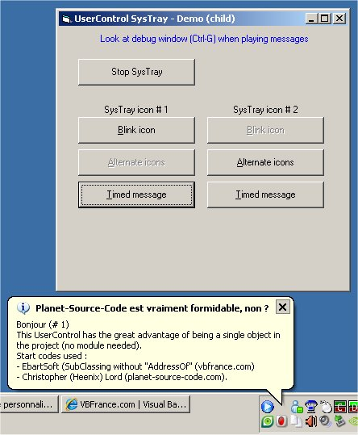



## Icon\(s\) SysTray and Balloons in a single UserControl file

### Description

This SysTray Icon works in a single UserControl you can easily install on your forms ## No more declaration to do ## Icons can blink or can alternate with a second one ## Delayed Balloons support Unicode (W) text ## Events return to host form for Balloon_Click, TimeOut and so on ## System message are intercepted from inside de UserControl, no additional module required (see authors of SubClassing in comments) ## Interface and procedures name are english, but most of comments are in french (native language) ## Enjoy it and transform your SysTay to Chrismas tree !
 
### More Info
 

             |
---                |---
**Submitted On**   |2009-08-14 23:10:02
**By**             |[The\_Jokez](https://github.com/Planet-Source-Code/PSCIndex/blob/master/ByAuthor/the-jokez.md)
**Level**          |Intermediate
**User Rating**    |5.0 (15 globes from 3 users)
**Compatibility**  |VB 5\.0, VB 6\.0
**Category**       |[Custom Controls/ Forms/  Menus](https://github.com/Planet-Source-Code/PSCIndex/blob/master/ByCategory/custom-controls-forms-menus__1-4.md)
**World**          |[Visual Basic](https://github.com/Planet-Source-Code/PSCIndex/blob/master/ByWorld/visual-basic.md)
**Archive File**   |[Icon\(s\)\_Sy2159978142009\.zip](https://github.com/Planet-Source-Code/the-jokez-icon-s-systray-and-balloons-in-a-single-usercontrol-file__1-72358/archive/master.zip)

